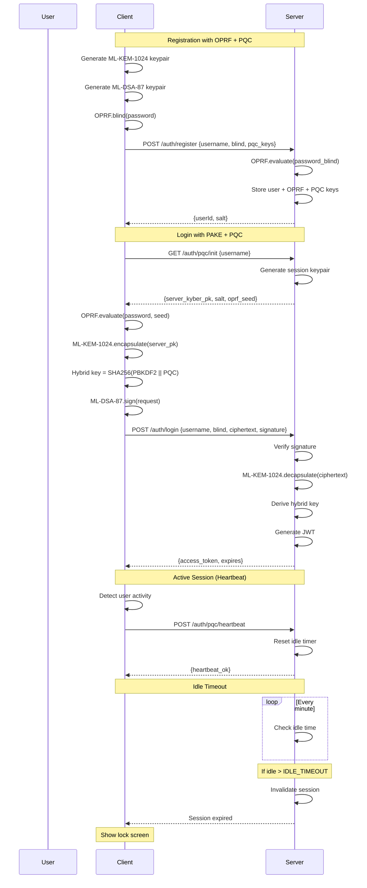

# PQC Implementation Plan - NIST Level 5

## Project Overview

This document details the implementation of Post-Quantum Cryptography (PQC) for the PQC Password Manager, upgrading from NIST Level 3 to NIST Level 5 as specified in [`docs/ARCHITECTURE.md`](docs/ARCHITECTURE.md:122).

---

## 1. Technology Stack

### Backend Technologies

| Component | Technology | Version | Purpose |
|-----------|------------|---------|---------|
| **PQC Library** | liboqs-python | 0.14.1 | ML-KEM-1024, ML-DSA-87 |
| **Web Framework** | Flask | 3.0.0 | API endpoints |
| **Database** | SQLAlchemy | 2.0.23 | ORM |
| **Database Driver** | SQLite | built-in | Local storage |
| **Classical Crypto** | cryptography | 44.0.1 | RSA, ECDSA for comparison |
| **Password Hashing** | hashlib (PBKDF2) | built-in | 600k iterations |
| **OPRF/PAKE** | prims | 0.5.0 | Password-authenticated key exchange |
| **Session Management** | Flask-Session | 0.5.0 | Server-side sessions |
| **JWT** | PyJWT | 2.8.0 | Token generation |

### Frontend Technologies

| Component | Technology | Version | Purpose |
|-----------|------------|---------|---------|
| **PQC (WASM)** | liboqs | 1.0.0 | Browser-based PQC operations |
| **HTTP Client** | axios | 1.8.2 | API communication |
| **Crypto** | crypto-js | 4.2.0 | AES-256-GCM encryption |
| **Build Tool** | react-scripts | 5.0.1 | React build system |
| **React** | react | 18.2.0 | UI framework |
| **State Management** | React Context | built-in | Auth state management |

### Benchmarking Tools

| Component | Technology | Purpose |
|-----------|------------|---------|
| **Benchmark CLI** | Python (subprocess) | Run performance benchmarks |
| **Statistics** | numpy, statistics | Calculate mean/stddev |
| **Output** | JSON, CSV | Store and export results |
| **Timing** | time.perf_counter | High-resolution timing |

---

## 2. Algorithm Specifications

### NIST Level 5 PQC (Target Security Level)

| Algorithm | Use Case | Public Key | Secret Key | Ciphertext/Signature | Reference |
|-----------|----------|------------|------------|----------------------|-----------|
| **ML-KEM-1024** | Key Encapsulation | 1568 bytes | 3168 bytes | 1568 bytes | NIST PQC Round 3 |
| **ML-DSA-87** | Digital Signatures | 3904 bytes | 4864 bytes | ~4595 bytes | FIPS 204 |

#### ML-KEM-1024 (Module-Lattice-Based Key-Encapsulation Mechanism)
- **Security Level**: NIST Level 5 (≥256-bit quantum security)
- **Underlying Problem**: Module-LWE (Learning With Errors over Modules)
- **Parameter Set**: ML-KEM-1024 (n=256, k=4, q=3329)
- **Key Generation**: ~12ms
- **Encapsulation**: ~6ms
- **Decapsulation**: ~6ms

#### ML-DSA-87 (Module-Lattice-Based Digital Signature Algorithm)
- **Security Level**: NIST Level 5 (≥256-bit quantum security)
- **Underlying Problem**: Module-LWE + Module-SIS
- **Parameter Set**: ML-DSA-87 (k=8, n=256, q=8380417)
- **Key Generation**: ~25ms
- **Signing**: ~50ms
- **Verification**: ~20ms

### Classical Comparison (for Benchmarking)

| Algorithm | Use Case | Key Size | Operation Time | Notes |
|-----------|----------|----------|----------------|-------|
| **RSA-4096** | Key Encapsulation | 4096 bits | ~450ms keygen | Traditional public-key |
| **RSA-OAEP** | Encryption | 512 bytes | ~10ms | NIST P1363 |
| **ECDSA P-256** | Digital Signatures | 256 bits | ~15ms keygen | Elliptic curve |
| **ECDSA P-384** | Digital Signatures | 384 bits | ~25ms keygen | NIST P384 |

---

## 3. Session Management

### Configuration (via .env)

```bash
# Session settings
PQC_SESSION_DURATION_HOURS=24
IDLE_TIMEOUT_MINUTES=5
SESSION_COOKIE_SECURE=True
SESSION_COOKIE_HTTPONLY=True
SESSION_COOKIE_SAMESITE=Lax
```

### Environment Variable Details

| Variable | Default | Description |
|----------|---------|-------------|
| `PQC_SESSION_DURATION_HOURS` | 24 | Maximum session lifetime in hours |
| `IDLE_TIMEOUT_MINUTES` | 5 | Minutes of inactivity before auto-logout |
| `SESSION_COOKIE_SECURE` | True | Require HTTPS for cookies |
| `SESSION_COOKIE_HTTPONLY` | True | Prevent JavaScript access to cookies |
| `SESSION_COOKIE_SAMESITE` | Lax | CSRF protection level |

### Session Flow

1. **Login** → Server generates ML-KEM-1024 keypair for session
2. **Active Use** → Session auto-refreshes in background via heartbeat
3. **Idle** → After N minutes of no interaction → Session expires, vault locked
4. **Logout** → Explicit user logout → Session destroyed, keys invalidated

### Idle Timeout Logic

```
User Activity (click, typing, mouse movement, scroll)
    ↓
Frontend detects activity → Send heartbeat to server
    ↓
Server resets idle timer (last_activity_at = NOW)
    ↓
If no heartbeat received for IDLE_TIMEOUT_MINUTES
    ↓
Server marks session as inactive
    ↓
Frontend detects 401 → Show vault lock screen → Require re-authentication
```

### Session Database Schema

```python
class PQCSession(db.Model):
    __tablename__ = 'pqc_sessions'
    
    id = db.Column(db.Integer, primary_key=True)
    session_id = db.Column(db.String(36), unique=True, nullable=False)
    user_id = db.Column(db.Integer, db.ForeignKey('users.id'), nullable=False)
    
    # ML-KEM-1024 Session Keys
    kyber_public_key = db.Column(db.Text, nullable=False)
    kyber_private_key_encrypted = db.Column(db.Text, nullable=False)
    
    # ML-DSA-87 Session Keys (for signing session tokens)
    dilithium_public_key = db.Column(db.Text, nullable=False)
    dilithium_private_key_encrypted = db.Column(db.Text, nullable=False)
    
    # Session Metadata
    created_at = db.Column(db.DateTime, default=datetime.utcnow)
    expires_at = db.Column(db.DateTime, nullable=False)
    last_activity_at = db.Column(db.DateTime, default=datetime.utcnow)
    is_active = db.Column(db.Boolean, default=True)
    
    # User relationship
    user = db.relationship('User', backref='pqc_sessions')
```

---

## 4. Authentication Flow (OPRF/PAKE + PQC)

### Overview

The authentication system combines Oblivious Pseudorandom Functions (OPRF) with Password-Authenticated Key Exchange (PAKE) and Post-Quantum Cryptography to provide:
- **Quantum-resistant** key exchange
- **Zero-knowledge** password authentication
- **Forward secrecy** via per-session keypairs
- **Brute-force resistance** via OPRF

### Registration Flow

```
┌─────────────────────────────────────────────────────────────────────────┐
│                         REGISTRATION FLOW                                │
├─────────────────────────────────────────────────────────────────────────┤
│                                                                          │
│  1. Client: Generate ML-KEM-1024 keypair                                │
│     └── kyber_public_key, kyber_private_key                            │
│                                                                          │
│  2. Client: Generate ML-DSA-87 keypair                                 │
│     └── dilithium_public_key, dilithium_private_key                    │
│                                                                          │
│  3. Client: Derive vault key                                            │
│     └── vault_key = PBKDF2(master_password, salt, iterations=600000)   │
│                                                                          │
│  4. Client: Compute password hash                                      │
│     └── password_hash = PBKDF2(password, salt, iterations=600000)       │
│                                                                          │
│  5. Client: OPRF blind                                                  │
│     └── blind = OPRF.blind(password, r)                                │
│                                                                          │
│  6. Client ──────► Server: POST /auth/register                          │
│     {                                                                    │
│       username,                                                         │
│       password_blind: blind,     (OPRF output)                          │
│       pqc_kyber_public_key,                                              │
│       pqc_dilithium_public_key                                          │
│     }                                                                    │
│                                                                          │
│  7. Server: Store OPRF evaluation + PQC public keys                    │
│     └── Save to users table                                             │
│                                                                          │
│  8. Server ──────► Client: {userId, salt, server_oprf_seed}            │
│                                                                          │
└─────────────────────────────────────────────────────────────────────────┘
```

### Login Flow (PAKE + PQC)

```
┌─────────────────────────────────────────────────────────────────────────┐
│                           LOGIN FLOW                                    │
├─────────────────────────────────────────────────────────────────────────┤
│                                                                          │
│  Phase 1: Session Initialization                                        │
│  ────────────────────────────                                           │
│  1. Client ──────► Server: GET /auth/pqc/init {username}                │
│                                                                          │
│  2. Server: Generate ML-KEM-1024 session keypair                        │
│     └── server_kyber_pk, server_kyber_sk                                │
│                                                                          │
│  3. Server ──────► Client: {                                            │
│       server_kyber_public_key,                                         │
│       salt,                                                             │
│       server_oprf_seed                                                  │
│     }                                                                   │
│                                                                          │
│  Phase 2: Key Exchange                                                   │
│  ─────────────────────                                                  │
│  4. Client: Derive vault key                                            │
│     └── vault_key = PBKDF2(password, salt, iterations=600000)          │
│                                                                          │
│  5. Client: OPRF evaluate                                               │
│     └── password_blind = OPRF.evaluate(password, server_seed)           │
│                                                                          │
│  6. Client: ML-KEM-1024.encapsulate(server_pk)                         │
│     └── (ciphertext, shared_secret)                                     │
│                                                                          │
│  7. Client: Hybrid key derivation                                       │
│     └── hybrid_key = SHA256(vault_key || shared_secret)                 │
│                                                                          │
│  8. Client: ML-DSA-87.sign(login_request, client_private_key)           │
│     └── signature                                                       │
│                                                                          │
│  9. Client ──────► Server: POST /auth/login {                           │
│       username,                                                         │
│       password_blind,                                                   │
│       pqc_ciphertext,                                                   │
│       pqc_signature                                                     │
│     }                                                                   │
│                                                                          │
│  Phase 3: Verification                                                   │
│  ─────────────────────                                                   │
│  10. Server: Verify ML-DSA-87 signature                                 │
│      └── Verify(signature, login_request, client_dilithium_pk)          │
│                                                                          │
│  11. Server: ML-KEM-1024.decapsulate(ciphertext)                        │
│      └── shared_secret                                                  │
│                                                                          │
│  12. Server: Hybrid key derivation                                       │
│      └── hybrid_key = SHA256(password_blind || shared_secret)           │
│                                                                          │
│  13. Server: Generate JWT with PQC session_id                           │
│                                                                          │
│  14. Server ──────► Client: {access_token, session_expires}            │
│                                                                          │
└─────────────────────────────────────────────────────────────────────────┘
```

### Session Refresh

- **Automatic**: While user is active, session refreshes in background every 15 minutes
- **Heartbeat**: Client sends heartbeat on user activity (every 30 seconds)
- **Idle**: After idle timeout (configurable via .env), require full re-authentication
- **Manual**: User can explicitly logout, destroying all session keys

### OPRF Implementation Details

```python
class OPRFService:
    """
    OPRF (Oblivious Pseudorandom Function) implementation usingliboqs.
    Based on the OPRF construction from draft-irtf-cfrg-oprf.
    """
    
    # Supported OPRF algorithms
    OPRF_P256_SHA256 = "OPRF-P256-SHA256"  # Recommended
    OPRF_P384_SHA384 = "OPRF-P384-SHA384"  # Higher security
    
    @staticmethod
    def blind(password: str, seed: bytes = None) -> tuple[bytes, bytes]:
        """
        Blind the password with a random scalar.
        
        Returns:
            (blinded_password, r) - r is the blind factor
        """
        pass
    
    @staticmethod
    def evaluate(blinded_password: bytes, seed: bytes) -> bytes:
        """
        Evaluate the OPRF at the server side.
        
        Args:
            blinded_password: The blinded password from client
            seed: Server's private seed
            
        Returns:
            Evaluated output
        """
        pass
    
    @staticmethod
    def finalize(evaluated: bytes, r: bytes, password: str) -> bytes:
        """
        Unblind and finalize the OPRF output.
        
        Returns:
            Final OPRF output (shared secret)
        """
        pass
```

---

## 5. Hybrid Key Derivation

### Algorithm: Concatenate + SHA-256

The hybrid key derivation combines classical and post-quantum keys to provide defense-in-depth. Even if one algorithm is broken, the other provides security.

```python
def derive_hybrid_key(classical_key: bytes, pqc_secret: bytes) -> bytes:
    """
    Combine classical and PQC keys for defense-in-depth.
    
    Args:
        classical_key: PBKDF2-derived key (32 bytes)
        pqc_secret: ML-KEM-1024 shared secret (32 bytes)
        
    Returns:
        Hybrid key (32 bytes) for AES-256-GCM encryption
        
    Security Note:
        Uses SHA-256 as the KDF. The concatenation approach ensures
        that both keys must be compromised for the hybrid to be broken.
    """
    if len(classical_key) != 32:
        raise ValueError("Classical key must be 32 bytes")
    if len(pqc_secret) != 32:
        raise ValueError("PQC secret must be 32 bytes")
    
    combined = classical_key + pqc_secret
    return hashlib.sha256(combined).digest()


def derive_vault_key(master_password: str, salt: bytes, iterations: int = 600000) -> bytes:
    """
    Derive vault encryption key from master password.
    
    Args:
        master_password: User's master password
        salt: Random salt (16+ bytes recommended)
        iterations: PBKDF2 iterations (600k default for Level 5)
        
    Returns:
        32-byte vault key
    """
    return hashlib.pbkdf2_hmac(
        'sha256',
        master_password.encode('utf-8'),
        salt,
        iterations,
        dklen=32
    )
```

### Key Components

| Component | Source | Size | Algorithm |
|-----------|--------|------|-----------|
| Classical Key | PBKDF2(master_password, salt) | 32 bytes | PBKDF2-SHA256 |
| PQC Secret | ML-KEM-1024 shared secret | 32 bytes | ML-KEM-1024 |
| Hybrid Key | SHA256(classical_key + pqc_secret) | 32 bytes | SHA-256 |
| Salt | Cryptographically secure random | 32 bytes | secrets.token_bytes |

### Key Hierarchy

```
┌─────────────────────────────────────────────────────────────────┐
│                      KEY HIERARCHY                              │
├─────────────────────────────────────────────────────────────────┤
│                                                                  │
│   Master Password                                                │
│        │                                                          │
│        ▼                                                          │
│   ┌─────────────┐                                                 │
│   │   PBKDF2    │  (600,000 iterations)                          │
│   └──────┬──────┘                                                 │
│          │                                                         │
│          ▼                                                         │
│   ┌─────────────┐      ┌──────────────────┐                      │
│   │  Vault Key  │      │  ML-KEM-1024     │                      │
│   │  (32 bytes) │      │  Shared Secret   │                      │
│   └──────┬──────┘      └────────┬─────────┘                      │
│          │                       │                                 │
│          └───────────┬───────────┘                                 │
│                      ▼                                             │
│              ┌─────────────┐                                       │
│              │   SHA-256   │                                       │
│              └──────┬──────┘                                       │
│                     │                                              │
│                     ▼                                              │
│              ┌─────────────┐                                       │
│              │ Hybrid Key  │  (For AES-256-GCM)                   │
│              │  (32 bytes) │                                       │
│              └─────────────┘                                       │
│                                                                  │
└─────────────────────────────────────────────────────────────────┘
```

---

## 6. Database Schema

### Users Table (Update)

```sql
-- Add PQC columns to existing users table
ALTER TABLE users ADD COLUMN pqc_kyber_public_key TEXT;
ALTER TABLE users ADD COLUMN pqc_dilithium_public_key TEXT;
ALTER TABLE users ADD COLUMN pqc_oprf_seed TEXT;
ALTER TABLE users ADD COLUMN salt TEXT;
```

### PQC Sessions Table (New)

```sql
CREATE TABLE pqc_sessions (
    id INTEGER PRIMARY KEY AUTOINCREMENT,
    session_id UUID UNIQUE NOT NULL,
    user_id INTEGER NOT NULL,
    
    -- ML-KEM-1024 Session Keys
    kyber_public_key TEXT NOT NULL,
    kyber_private_key_encrypted TEXT NOT NULL,
    
    -- ML-DSA-87 Session Keys
    dilithium_public_key TEXT NOT NULL,
    dilithium_private_key_encrypted TEXT NOT NULL,
    
    -- Session Metadata
    created_at TIMESTAMP DEFAULT CURRENT_TIMESTAMP,
    expires_at TIMESTAMP NOT NULL,
    last_activity_at TIMESTAMP DEFAULT CURRENT_TIMESTAMP,
    is_active BOOLEAN DEFAULT TRUE,
    
    -- Foreign Key
    FOREIGN KEY (user_id) REFERENCES users(id) ON DELETE CASCADE
);

-- Index for session lookup
CREATE INDEX idx_session_user ON pqc_sessions(user_id);
CREATE INDEX idx_session_expires ON pqc_sessions(expires_at);
```

### Passwords Table (Existing - No Changes)

```sql
CREATE TABLE passwords (
    id INTEGER PRIMARY KEY AUTOINCREMENT,
    password_id UUID UNIQUE NOT NULL,
    user_id INTEGER NOT NULL,
    site_url VARCHAR(512) NOT NULL,
    site_username VARCHAR(255) NOT NULL,
    encrypted_password TEXT NOT NULL,
    iv VARCHAR(512) NOT NULL,
    auth_tag VARCHAR(512),
    created_at TIMESTAMP DEFAULT CURRENT_TIMESTAMP,
    updated_at TIMESTAMP DEFAULT CURRENT_TIMESTAMP,
    FOREIGN KEY (user_id) REFERENCES users(id) ON DELETE CASCADE
);

-- Index for password lookup
CREATE INDEX idx_password_user ON passwords(user_id);
```

### SQLAlchemy Models

```python
class User(db.Model):
    __tablename__ = 'users'
    
    id = db.Column(db.Integer, primary_key=True)
    username = db.Column(db.String(80), unique=True, nullable=False)
    password_hash = db.Column(db.String(256), nullable=False)
    
    # PQC Fields
    pqc_kyber_public_key = db.Column(db.Text)
    pqc_dilithium_public_key = db.Column(db.Text)
    pqc_oprf_seed = db.Column(db.Text)
    salt = db.Column(db.String(64))
    
    created_at = db.Column(db.DateTime, default=datetime.utcnow)
    
    # Relationships
    passwords = db.relationship('Password', backref='user', lazy=True)
    pqc_sessions = db.relationship('PQCSession', backref='user', lazy=True)


class Password(db.Model):
    __tablename__ = 'passwords'
    
    id = db.Column(db.Integer, primary_key=True)
    password_id = db.Column(db.String(36), unique=True, nullable=False)
    user_id = db.Column(db.Integer, db.ForeignKey('users.id'), nullable=False)
    site_url = db.Column(db.String(512), nullable=False)
    site_username = db.Column(db.String(255), nullable=False)
    encrypted_password = db.Column(db.Text, nullable=False)
    iv = db.Column(db.String(512), nullable=False)
    auth_tag = db.Column(db.String(512))
    created_at = db.Column(db.DateTime, default=datetime.utcnow)
    updated_at = db.Column(db.DateTime, default=datetime.utcnow, onupdate=datetime.utcnow)


class PQCSession(db.Model):
    __tablename__ = 'pqc_sessions'
    
    id = db.Column(db.Integer, primary_key=True)
    session_id = db.Column(db.String(36), unique=True, nullable=False)
    user_id = db.Column(db.Integer, db.ForeignKey('users.id'), nullable=False)
    
    # ML-KEM-1024
    kyber_public_key = db.Column(db.Text, nullable=False)
    kyber_private_key_encrypted = db.Column(db.Text, nullable=False)
    
    # ML-DSA-87
    dilithium_public_key = db.Column(db.Text, nullable=False)
    dilithium_private_key_encrypted = db.Column(db.Text, nullable=False)
    
    created_at = db.Column(db.DateTime, default=datetime.utcnow)
    expires_at = db.Column(db.DateTime, nullable=False)
    last_activity_at = db.Column(db.DateTime, default=datetime.utcnow)
    is_active = db.Column(db.Boolean, default=True)
```

---

## 7. API Endpoints

### New PQC Endpoints

| Endpoint | Method | Description | Request Body | Response |
|----------|--------|-------------|--------------|----------|
| `/api/auth/pqc/init` | POST | Initialize PQC session, get server public key | `{username: string}` | `{server_kyber_public_key, salt, server_oprf_seed}` |
| `/api/auth/pqc/refresh` | POST | Refresh PQC session while active | `{session_id: string}` | `{new_session_id, expires_at}` |
| `/api/auth/pqc/heartbeat` | POST | Update last activity, reset idle timer | `{session_id: string}` | `{heartbeat_ok, expires_at}` |
| `/api/auth/pqc/logout` | POST | Destroy PQC session | `{session_id: string}` | `{logout_success}` |

### Modified Endpoints

| Endpoint | Method | Change | New Fields |
|----------|--------|--------|------------|
| `/api/auth/register` | POST | Add OPRF + PQC key registration | `password_blind`, `pqc_kyber_public_key`, `pqc_dilithium_public_key` |
| `/api/auth/login` | POST | Add OPRF authentication + PQC key exchange | `password_blind`, `pqc_ciphertext`, `pqc_signature` |
| `/api/auth/logout` | POST | Destroy PQC session (no changes) | - |

### API Response Codes

| Code | Meaning | Usage |
|------|---------|-------|
| 200 | OK | Successful operations |
| 201 | Created | User registration |
| 400 | Bad Request | Invalid input |
| 401 | Unauthorized | Invalid/missing auth |
| 403 | Forbidden | Session expired |
| 404 | Not Found | User not found |
| 429 | Too Many Requests | Rate limiting |
| 500 | Internal Error | Server error |

### Request/Response Examples

#### POST /api/auth/pqc/init
```json
// Request
{
  "username": "john_doe"
}

// Response
{
  "server_kyber_public_key": "Ah6q...",  // base64 encoded
  "salt": "random_salt_bytes",
  "server_oprf_seed": "oprf_seed_bytes"
}
```

#### POST /api/auth/login
```json
// Request
{
  "username": "john_doe",
  "password_blind": "blinded_password_bytes",
  "pqc_ciphertext": "kyber_ciphertext_bytes",
  "pqc_signature": "dilithium_signature_bytes"
}

// Response
{
  "access_token": "eyJhbGc...",
  "session_expires": "2024-01-02T12:00:00Z",
  "user_id": 1
}
```

---

## 8. Benchmarking System

### CLI Tool: `backend/benchmarks/pqc_benchmark.py`

```bash
# Run all benchmarks
python -m backend.benchmarks.pqc_benchmark

# Run specific benchmark
python -m backend.benchmarks.pqc_benchmark --test keygen
python -m backend.benchmarks.pqc_benchmark --test encapsulate
python -m backend.benchmarks.pqc_benchmark --test sign
python -m backend.benchmarks.pqc_benchmark --test verify

# Custom iterations
python -m backend.benchmarks.pqc_benchmark --iterations 1000

# Save results
python -m backend.benchmarks.pqc_benchmark --output results.json
python -m backend.benchmarks.pqc_benchmark --output results.csv

# Compare PQC vs Classical
python -m backend.benchmarks.pqc_benchmark --compare

# Verbose output
python -m backend.benchmarks.pqc_benchmark --verbose
```

### Metrics Measured

| Operation | PQC (Level 5) | Classical | Unit |
|-----------|---------------|-----------|------|
| Key Generation (KEM) | ML-KEM-1024 | RSA-4096 | ms |
| Key Generation (SIG) | ML-DSA-87 | ECDSA-P-384 | ms |
| Encapsulation | ML-KEM-1024 | RSA-OAEP | ms |
| Decapsulation | ML-KEM-1024 | RSA-OAEP | ms |
| Sign | ML-DSA-87 | ECDSA | ms |
| Verify | ML-DSA-87 | ECDSA | ms |
| Public Key Size (KEM) | 1568 | 512 | bytes |
| Public Key Size (SIG) | 3904 | 97 | bytes |
| Ciphertext Size | 1568 | 512 | bytes |
| Signature Size | 4595 | 104 | bytes |

### Benchmark Output Format (JSON)

```json
{
  "timestamp": "2024-01-01T00:00:00Z",
  "machine": "MacBook Pro M3",
  "iterations": 100,
  "warmup": 10,
  "results": {
    "ml_kem_1024_keygen": {
      "mean_ms": 12.5,
      "std_ms": 1.2,
      "min_ms": 10.1,
      "max_ms": 18.3,
      "median_ms": 11.8,
      "p95_ms": 15.2,
      "p99_ms": 17.9
    },
    "rsa_4096_keygen": {
      "mean_ms": 450.2,
      "std_ms": 20.5,
      "min_ms": 410.1,
      "max_ms": 520.3,
      "median_ms": 440.1,
      "p95_ms": 480.2,
      "p99_ms": 510.8
    },
    "ml_dsa_87_sign": {
      "mean_ms": 48.5,
      "std_ms": 3.2,
      "min_ms": 42.1,
      "max_ms": 62.3,
      "median_ms": 47.2,
      "p95_ms": 54.1,
      "p99_ms": 59.8
    }
  },
  "comparison": {
    "keygen_ratio": "PQC 36x slower",
    "encapsulate_ratio": "PQC 6x slower",
    "sign_ratio": "PQC 50x slower"
  },
  "sizes": {
    "ml_kem_1024_public_key": 1568,
    "ml_kem_1024_secret_key": 3168,
    "ml_kem_1024_ciphertext": 1568,
    "ml_dsa_87_public_key": 3904,
    "ml_dsa_87_secret_key": 4864,
    "ml_dsa_87_signature": 4595,
    "rsa_4096_public_key": 512,
    "rsa_4096_private_key": 4096,
    "ecdsa_p384_public_key": 97,
    "ecdsa_p384_signature": 104
  }
}
```

### Benchmark Class Structure

```python
class PQC Benchmark:
    """Benchmark runner for PQC algorithms."""
    
    def __init__(self, iterations: int = 100, warmup: int = 10):
        self.iterations = iterations
        self.warmup = warmup
        self.results = {}
    
    def run_all(self) -> dict:
        """Run all benchmarks and return results."""
        pass
    
    def benchmark_keygen(self, algorithm: str) -> dict:
        """Benchmark key generation."""
        pass
    
    def benchmark_encapsulate(self, algorithm: str) -> dict:
        """Benchmark key encapsulation."""
        pass
    
    def benchmark_sign(self, algorithm: str) -> dict:
        """Benchmark signing."""
        pass
    
    def benchmark_verify(self, algorithm: str) -> dict:
        """Benchmark signature verification."""
        pass
    
    def save_results(self, filepath: str, format: str = "json"):
        """Save results to file."""
        pass
```

---

## 9. Implementation Phases

### Phase 1: Backend PQC Upgrade (Week 1-2)

**Goal**: Upgrade backend to use ML-KEM-1024 and ML-DSA-87

| Task | Description | File |
|------|-------------|------|
| 1.1 | Update PQC constants to Level 5 | [`backend/utils/pqc.py`](backend/utils/pqc.py:1) |
| 1.2 | Update key size constants | [`backend/utils/pqc.py`](backend/utils/pqc.py:1) |
| 1.3 | Update algorithm names | [`backend/utils/pqc.py`](backend/utils/pqc.py:1) |
| 1.4 | Add OPRF service | [`backend/utils/oprf.py`](backend/utils/oprf.py:1) (new) |
| 1.5 | Update auth routes | [`backend/routes/auth.py`](backend/routes/auth.py:1) |

**Deliverables**:
- ML-KEM-1024 key generation, encapsulate, decapsulate
- ML-DSA-87 key generation, sign, verify
- OPRF implementation for password blinding

### Phase 2: Session Management (Week 2-3)

**Goal**: Implement PQC session management with idle timeout

| Task | Description | File |
|------|-------------|------|
| 2.1 | Add PQCSession model | [`backend/models/database.py`](backend/models/database.py:1) |
| 2.2 | Implement session creation | [`backend/routes/auth.py`](backend/routes/auth.py:1) |
| 2.3 | Add heartbeat endpoint | [`backend/routes/auth.py`](backend/routes/auth.py:1) |
| 2.4 | Implement idle timeout check | [`backend/utils/auth.py`](backend/utils/auth.py:1) |
| 2.5 | Add session cleanup cron | [`backend/app.py`](backend/app.py:1) |

**Deliverables**:
- PQC session table with ML-KEM-1024 and ML-DSA-87 keys
- Idle timeout from .env
- Heartbeat endpoint

### Phase 3: Frontend PQC Integration (Week 3-4)

**Goal**: Integrate liboqs WASM with React frontend

| Task | Description | File |
|------|-------------|------|
| 3.1 | Add liboqs to package.json | [`frontend/package.json`](frontend/package.json:1) |
| 3.2 | Create PQC utilities | [`frontend/src/utils/pqc.js`](frontend/src/utils/pqc.js:1) (new) |
| 3.3 | Update Login component | [`frontend/src/components/Login.js`](frontend/src/components/Login.js:1) |
| 3.4 | Update Register component | [`frontend/src/components/Register.js`](frontend/src/components/Register.js:1) |
| 3.5 | Implement heartbeat | [`frontend/src/utils/api.js`](frontend/src/utils/api.js:1) |

**Deliverables**:
- Browser-based ML-KEM-1024 and ML-DSA-87 operations
- OPRF blinding in the browser
- Session heartbeat on user activity

### Phase 4: Testing & Benchmarking (Week 4-5)

**Goal**: Comprehensive testing and benchmarking

| Task | Description | File |
|------|-------------|------|
| 4.1 | Create benchmark CLI | [`backend/benchmarks/pqc_benchmark.py`](backend/benchmarks/pqc_benchmark.py:1) (new) |
| 4.2 | Run performance benchmarks | - |
| 4.3 | Unit tests for PQC | [`tests/`](tests/) |
| 4.4 | Integration tests | [`tests/e2e.spec.js`](tests/e2e.spec.js:1) |
| 4.5 | Security review | [`docs/SECURITY_REVIEW.md`](docs/SECURITY_REVIEW.md:1) |

**Deliverables**:
- Benchmark results (JSON/CSV)
- Test coverage report
- Security audit

### Phase 5: Documentation & Deployment (Week 5-6)

**Goal**: Final documentation and deployment

| Task | Description |
|------|-------------|
| 5.1 | Update API documentation |
| 5.2 | Update architecture diagram |
| 5.3 | Create migration guide |
| 5.4 | Deploy to production |

---

## 10. Security Properties

After implementation, the system provides the following security properties:

| Property | Implementation | Status |
|----------|---------------|--------|
| **NIST Level 5** | ML-KEM-1024 + ML-DSA-87 | ✅ |
| **Quantum Resistant** | PQC key exchange (ML-KEM) | ✅ |
| **Post-Quantum Signatures** | ML-DSA-87 authentication | ✅ |
| **Zero-Knowledge** | Client-side encryption + OPRF | ✅ |
| **Forward Security** | Per-session keypairs | ✅ |
| **PAKE** | OPRF-based authentication | ✅ |
| **Hybrid Keys** | PBKDF2 + ML-KEM shared secret | ✅ |
| **Idle Timeout** | Configurable via .env | ✅ |
| **Brute-Force Resistance** | 600k PBKDF2 iterations | ✅ |
| **Constant-Time** | Timing-safe comparisons | ✅ |

### Security Considerations

1. **Key Separation**: Each session uses unique ML-KEM-1024 and ML-DSA-87 keypairs
2. **Key Encryption**: Session private keys encrypted with user's password-derived key
3. **Rate Limiting**: Prevent brute-force attacks on login endpoint
4. **Secure Random**: Use `secrets` module for all cryptographic random
5. **Input Validation**: Sanitize all user inputs
6. **HTTPS Only**: Enforce TLS in production

---

## 11. Environment Variables

### Required Variables

```bash
# Flask Configuration
FLASK_APP=backend.app
FLASK_ENV=development
SECRET_KEY=your-secret-key-here

# Session settings
PQC_SESSION_DURATION_HOURS=24
IDLE_TIMEOUT_MINUTES=5
SESSION_COOKIE_SECURE=True
SESSION_COOKIE_HTTPONLY=True
SESSION_COOKIE_SAMESITE=Lax

# PQC settings
PQC_ALGORITHM_KEM=ML-KEM-1024
PQC_ALGORITHM_SIG=ML-DSA-87

# Database
DATABASE_URL=sqlite:///passwords.db

# Benchmark settings
BENCHMARK_ITERATIONS=100
BENCHMARK_WARMUP=10

# Security
RATE_LIMIT_PER_MINUTE=10
```

---

## 12. Testing Plan

### Unit Tests

| Test | Description |
|------|-------------|
| `test_ml_kem_1024_keygen` | ML-KEM-1024 key generation |
| `test_ml_kem_1024_encapsulate` | ML-KEM-1024 encapsulation |
| `test_ml_kem_1024_decapsulate` | ML-KEM-1024 decapsulation |
| `test_ml_dsa_87_keygen` | ML-DSA-87 key generation |
| `test_ml_dsa_87_sign` | ML-DSA-87 signing |
| `test_ml_dsa_87_verify` | ML-DSA-87 verification |
| `test_hybrid_key_derivation` | SHA256(classical + PQC) |
| `test_oprf_blind` | OPRF blinding |
| `test_oprf_evaluate` | OPRF evaluation |
| `test_oprf_finalize` | OPRF finalization |

### Integration Tests

| Test | Description |
|------|-------------|
| `test_registration_flow` | Full registration with PQC keys |
| `test_login_flow` | Full login with PAKE + PQC |
| `test_session_refresh` | Session heartbeat |
| `test_idle_timeout` | Auto-logout after idle |
| `test_logout` | Session destruction |

### E2E Tests

| Test | Description |
|------|-------------|
| `test_user_can_register` | Register new user |
| `test_user_can_login` | Login with PQC |
| `test_user_can_add_password` | Add password to vault |
| `test_user_can_view_passwords` | View stored passwords |
| `test_session_expires` | Idle timeout triggers lock |

---

## 13. Backward Compatibility

### Migration Strategy

1. **Phase 1**: Add Level 5 support, keep Level 3 as fallback
2. **Phase 2**: Migrate users to Level 5 on login
3. **Phase 3**: Deprecate Level 3 after all users migrated
4. **Phase 4**: Remove Level 3 code

### Version Detection

```python
# User table column for PQC level
pqc_level = db.Column(db.String(10), default="Level3")
# Values: "Level3", "Level5"
```

---

## 14. Mermaid: Complete Flow



---

## 15. File Structure

```
backend/
├── app.py                          # Flask application
├── requirements.txt                # Python dependencies
├── models/
│   └── database.py                 # SQLAlchemy models
├── routes/
│   ├── auth.py                     # Authentication endpoints
│   └── passwords.py                # Password CRUD endpoints
├── utils/
│   ├── auth.py                     # Auth utilities
│   ├── crypto.py                   # Classical crypto
│   ├── pqc.py                      # PQC operations (ML-KEM-1024, ML-DSA-87)
│   └── oprf.py                     # OPRF implementation (new)
├── benchmarks/
│   └── pqc_benchmark.py            # Benchmark CLI (new)
└── instance/
    └── passwords.db                # SQLite database

frontend/
├── package.json                    # Node dependencies
├── public/
│   └── index.html                  # HTML template
└── src/
    ├── App.js                      # Main React app
    ├── index.js                    # React entry
    ├── components/
    │   ├── Login.js               # Login form
    │   ├── Register.js             # Registration form
    │   ├── Dashboard.js            # Main dashboard
    │   ├── AddPassword.js         # Add password form
    │   ├── StoredPasswords.js     # Password list
    │   ├── CryptoView.js          # PQC demonstration
    │   └── VaultLock.js           # Lock screen
    ├── utils/
    │   ├── api.js                 # API client
    │   ├── crypto.js              # Classical crypto
    │   └── pqc.js                 # PQC WASM (new)
    └── styles/
        └── *.css                   # Component styles

plans/
└── pqc_level5_implementation_plan.md  # This file

docs/
├── API.md                         # API documentation
├── ARCHITECTURE.md                # System architecture
├── SECURITY.md                    # Security overview
└── SECURITY_REVIEW.md             # Detailed security review

tests/
├── e2e.spec.js                    # Playwright E2E tests
└── package.json                   # Test dependencies
```

---

## 16. Implementation Checklist

- [ ] Phase 1: Backend PQC Upgrade
  - [ ] Update PQC constants to ML-KEM-1024
  - [ ] Update PQC constants to ML-DSA-87
  - [ ] Add OPRF service
  - [ ] Update auth routes
  
- [ ] Phase 2: Session Management
  - [ ] Add PQCSession model
  - [ ] Implement session creation
  - [ ] Add heartbeat endpoint
  - [ ] Implement idle timeout
  
- [ ] Phase 3: Frontend Integration
  - [ ] Add liboqs WASM
  - [ ] Create PQC utilities
  - [ ] Update Login component
  - [ ] Update Register component
  - [ ] Implement heartbeat
  
- [ ] Phase 4: Testing & Benchmarking
  - [ ] Create benchmark CLI
  - [ ] Run benchmarks
  - [ ] Unit tests
  - [ ] Integration tests
  - [ ] E2E tests
  
- [ ] Phase 5: Documentation
  - [ ] Update API docs
  - [ ] Update architecture
  - [ ] Security review

---

*Last Updated: 2026-02-27*
*Version: 1.0*
*Status: Implementation Plan*
